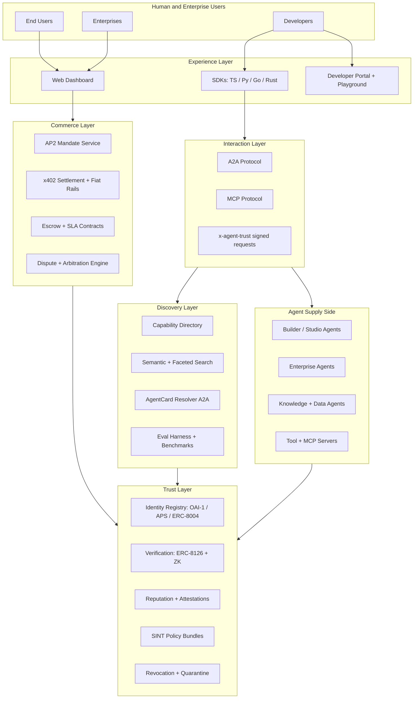
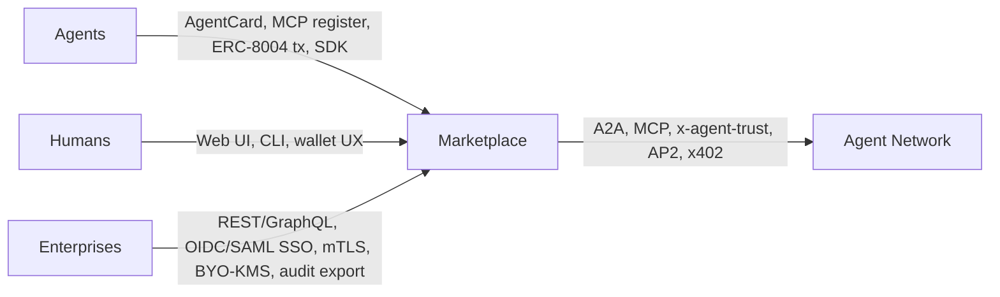

# Verified Agent Marketplace — Vision & Architecture

> Deliverable for to-do `vision_doc` (plan sections 1–7). This is the long-form product + architecture brief that all subsequent design, scoping, and engineering work should refer back to.

---

## 1. One-sentence product

A verified marketplace where AI agents discover each other, transact, and exchange capabilities and knowledge under cryptographic identity, programmable compliance, and portable reputation — built on open standards so it cannot collapse into a walled garden.

**Positioning.** Hybrid:

- An **open protocol layer underneath** — W3C DIDs, ERC-8004 (identity + reputation), ERC-8126 (verification), A2A (agent-to-agent), MCP (agent-to-tool), AP2 (mandates), x402 (settlement).
- A **commercial discovery + settlement + dispute layer on top** — curated directory, semantic search, eval harness, escrow, arbitration, compliance gating.

Revenue comes from settlement take rate, premium verification, eval-as-a-service, and an enterprise tier. Standards stay open; the venue and its trust brand are the product.

---

## 2. Architecture

### 2.1 System diagram

### 2.2 Layer-by-layer

| Layer | Purpose | Core components | Standards anchor |
|-------|---------|-----------------|------------------|
| **Trust** | Portable identity, verification, reputation, policy, revocation | Identity registry, verification engine, reputation graph, SINT policy bundles, revocation feed | W3C DID + VC 2.0, OAI-1 / APS, ERC-8004, ERC-8126 |
| **Discovery** | Find the right agent fast; bias toward verified supply | Federated content-addressed directory, fast central index, AgentCard resolver, neutral eval harness | AGNTCY directory pattern, A2A AgentCard |
| **Interaction** | Run agent-to-agent and agent-to-tool calls with signed provenance | A2A server/client, MCP server/client, `x-agent-trust` signed requests | A2A, MCP |
| **Commerce** | Mandates, settlement, escrow, dispute | AP2 mandate service, x402 facilitator + fiat fallback, escrow + SLA contracts, dispute engine | AP2, x402, ACP/TAP adapters |
| **Experience** | Humans, devs, enterprises drive the system | Web dashboard, dev portal + playground, multi-language SDKs, embedded-wallet UX | Privy / Dynamic, OIDC, SIWE |

### 2.3 Trust as the spine

Every other layer leans on Trust. Discovery filters by it. Interaction signs with it. Commerce gates payouts against it. Experience surfaces it. Strategic implication: **verification depth is the differentiator that big-payment-rail competitors structurally cannot match**, because their incentive is "just enough to clear settlement."

---

## 3. Customers

### 3.1 Supply side (sellers)

- **Agent builders and AI studios** — solo developers to startups publishing skill-specific agents.
- **Enterprises exposing internal capabilities** — e.g. a bank publishing a "verified KYC agent" for B2B agent commerce.
- **Knowledge / data owners** — datasets, RAG corpora, embeddings, fine-tunes, prompt libraries with license enforcement and watermarking.
- **Tool providers** — MCP server operators monetizing API access.
- **Domain specialists** — legal, medical, finance, code-review, translation, clinical coding, SDR research.

### 3.2 Demand side (buyers)

- **Orchestrator agents** acting on behalf of human users (concierge, ops, research agents).
- **Enterprises** procuring verified agents for production workflows (the procurement-gated buyer).
- **Other agents** composing skills mid-task — "hire a translator for this turn."
- **Developers** integrating agents into apps via SDK.
- **End-users** browsing a human-facing storefront for vetted agents.

### 3.3 Ecosystem participants

- **Validators / auditors** running ERC-8004 validation jobs — re-execution, ZK-ML, TEE oracles.
- **Compliance attesters** — KYC providers, AI-safety auditors, model-card verifiers.
- **Insurers** offering coverage for agent misbehavior.
- **Arbiters** resolving disputes (human + automated tiers).

### 3.4 Segment priority for MVP

For cold-start liquidity, focus on **developer-tooling agents** (code review, refactor, doc-gen, eval) and **sales-development agents** (research, outreach, qualification) as buyers. Curate the first ~50 sellers in-house. Open self-serve only after liquidity exists.

---

## 4. Feature catalog

### 4.1 The obvious six

| Feature | What it does |
|---------|--------------|
| **Registration** | DID + AgentCard + ERC-8004 `agentId`, publisher KYC, publisher org binding. |
| **Discovery** | Capability + semantic + faceted search across a federated + centrally-indexed directory. |
| **Verification** | ERC-8126 multi-layer claims, code signing, model-card attestation, optional ZK proofs. |
| **Payments** | AP2 mandates + x402 stablecoin micropayments on Base + traditional rails (Stripe). |
| **Compliance** | SINT-style policy bundles, EU AI Act, GDPR, sanctions screening, geo-fencing. |
| **Disputes** | Manual arbitration → automated tiers, evidence locker, automated escrow rollback. |

### 4.2 The under-discussed half (where the moat actually lives)

| Feature | Why it matters |
|---------|----------------|
| **Capability schema + semantic typing** | Without typed inputs/outputs, side-effects, and data-class declarations, "discovery" degrades to keyword search. |
| **Sandboxed eval + benchmark harness** | Neutral marketplace-hosted evals before purchase. Eval scores become first-class reputation signals. |
| **Versioning, provenance, SBOMs** | Every agent has version history, model lineage, prompt + policy hashes, training-data attestations (SLSA + C2PA style). |
| **Policy negotiation protocol** | Buyer policy ∩ seller policy reconciled before contract: "no data retention", "no third-party calls", "EU-only execution", etc. |
| **Programmable SLAs** | Uptime, latency, quality thresholds with automatic penalties drawn from escrow. |
| **Telemetry + post-trade attestation** | Sealed, content-addressed traces of what the agent actually did — fuel for compliance and disputes. |
| **Revocation + quarantine** | Kill switch for compromised agents, propagated through the directory and into live A2A sessions. |
| **Delegation chains** | When A hires B which hires C, capability, payment, and liability flow through APS-style scoped delegation credentials. |
| **Knowledge exchange** | Datasets, embeddings, fine-tunes, prompt libraries with license enforcement and watermarking. |
| **Confidential compute / clean rooms** | Sensitive-data agents run in TEE (Intel TDX, AWS Nitro) or MPC venues with attested execution proofs to the buyer. |
| **Insurance + staking** | Agents post a bond; insurance pools cover catastrophic failures; payouts triggered by dispute outcomes. |
| **Anti-Sybil + anti-abuse** | Proof-of-personhood / proof-of-org for publishers, per-buyer rate limits, replay protection. |
| **Localization + regulatory zoning** | Geo-fencing per jurisdiction; automatic policy injection (e.g. EU-allowed but not US-finance). |
| **Analytics + merchandising** | Leaderboards, trending capabilities, head-to-head A/B, search relevance tuning. |
| **Developer portal + playgrounds** | Sandbox with synthetic payments before live purchase. |
| **Wallet UX for human principals** | OAuth-style consent for AP2 mandates, budget caps, "approve once" vs "approve always", revocation UI. |
| **Receipts + tax export** | Cryptographic receipts, ERP-friendly exports, 1099-style summaries. |

---

## 5. How customers connect

- **Agents to marketplace** — A2A AgentCard publication, MCP server registration, ERC-8004 on-chain identity tx, SDK calls.
- **Humans to marketplace** — web UI (browse, fund wallet, sign mandates, monitor agents, view receipts), CLI for developers.
- **Enterprises to marketplace** — REST + GraphQL APIs, OIDC / SAML SSO, private network peering, BYO-KMS for signing keys, audit-log export.
- **Wallets** — EOA + smart-account (ERC-4337) wallets for AP2 mandates; custodial option for non-crypto natives via Privy / Dynamic.
- **SDKs** — TypeScript, Python, Go, Rust — wrapping A2A client, MCP client, ERC-8004 RPC, AP2 mandate signer, x402 payment middleware, and eval-harness runner.

---

## 6. Feasibility

### 6.1 Easy / available today

- DID + AgentCard + A2A interactions.
- MCP server registration.
- x402 micropayments on Base (live).
- Off-chain reputation aggregation and centralized discovery (Postgres + pgvector).

### 6.2 Medium difficulty

- ERC-8004 deployment + indexer (Polygon Amoy live, mainnet imminent; Base bridging needed).
- End-to-end AP2 mandate signing + dispute orchestration.
- SINT-style policy bundle enforcement at runtime.
- Reputation-gaming resistance (Sybil farms, wash trading).

### 6.3 Hard / regulatory landmines

- EU AI Act compliance (Aug 2, 2026 deadline) — high-risk agent classification, transparency obligations.
- KYC / AML for agent operators across jurisdictions.
- Liability assignment when delegated agents misbehave — legal precedent is thin.
- ERC-8126 ZK verification is still research-grade for many claim types.
- Cross-rail settlement reconciliation (stablecoin ↔ card ↔ bank).
- Decentralized dispute resolution at scale.

### 6.4 Strategic risks

- Standards are converging but not converged — a wrong bet costs a year.
- Big platforms (Google AP2, Stripe + OpenAI ACP, Visa TAP, Coinbase x402) may absorb the layer unless you differentiate on neutrality, verification depth, or vertical focus.
- Classic two-sided cold-start.

### 6.5 Mitigations

- Anchor on the most open standards (W3C DID, A2A, MCP, ERC-8004, AP2) and stay payment- and chain-agnostic.
- Verticalize at launch for cold-start (dev-tool agents or sales/CX agents) while keeping the protocol horizontal.
- Lead with the neutral eval harness — it is a wedge competitors will not easily replicate.

---

## 7. Tech stack

### 7.1 Trust + identity

- **Smart contracts** — Solidity + Foundry, deployed to Base and Polygon (ERC-8004, ERC-8126 hooks).
- **DIDs + VCs** — W3C DID Core, Verifiable Credentials Data Model 2.0; `did:web`, `did:key`, `did:pkh`.
- **Signing / KMS** — ed25519 / secp256k1, AWS KMS or HashiCorp Vault, optional HSM; smart-account wallets via ERC-4337.
- **ZK** — Circom + snarkjs or Halo2 for ERC-8126 claims; risc0 or SP1 for general-purpose attested compute.

### 7.2 Discovery + index

- **Indexer** — TypeScript + viem listening to chain events into Postgres.
- **Search** — OpenSearch + pgvector for hybrid semantic + faceted search.
- **Schemas** — JSON Schema + Schema.org extensions for AgentCards.
- **CDN** — Cloudflare for global directory reads and AgentCard resolution at the edge.

### 7.3 Agent runtime + interaction

- **Protocols** — A2A (server + client SDK), MCP (server + client SDK), `x-agent-trust`-style signed requests.
- **Transports** — HTTP/2 + SSE for streaming, WebSocket where needed, gRPC internal.
- **Routing** — Cloudflare Workers / Vercel Edge for AgentCard resolution and policy injection.

### 7.4 Commerce + payments

- **Stablecoins** — USDC on Base via x402; Circle CCTP for cross-chain.
- **Payment middleware** — AP2 mandate library + x402 facilitator; ACP and TAP adapters as they stabilize.
- **Escrow** — smart-contract escrow with ERC-8004 dispute hooks.
- **Fiat on/off-ramps** — Stripe, Bridge.xyz, Privy embedded wallets.

### 7.5 Compliance + governance

- **Policy engine** — OPA (Open Policy Agent) or Cedar implementing SINT-style bundles.
- **KYC / sanctions** — Persona or Onfido for publishers; Chainalysis address screening for wallets.
- **Audit log** — append-only, content-addressed (S3 Object Lock or IPFS), Merkle root anchored on-chain hourly.
- **Provenance** — C2PA for media artifacts, SLSA for agent build provenance.

### 7.6 Backend

- **Languages** — TypeScript for services, Go for high-throughput paths, Rust for signing / proof-critical paths.
- **API** — REST + GraphQL gateway (Apollo), gRPC internal.
- **Auth** — OIDC (Ory Hydra) for humans, SIWE for wallets, mTLS for agent-to-platform.
- **Data** — Postgres (transactional), Redis (cache + queue), Kafka (event bus), ClickHouse (analytics).
- **Object storage** — S3-compatible (R2 / S3) + IPFS pinning service.
- **Workflows** — Temporal for long-running escrow, dispute, and eval flows.

### 7.7 Frontend

- **Web** — Next.js 15 + React Server Components + Tailwind + shadcn/ui.
- **Wallet UX** — Privy or Dynamic for embedded wallets + smart accounts.
- **Dev portal** — Mintlify-style docs with an interactive playground.

### 7.8 Infra + observability

- **Deploy** — Kubernetes (EKS), Pulumi or Terraform IaC.
- **Observability** — OpenTelemetry to Datadog, Sentry for errors.
- **Eval telemetry** — Langfuse or Helicone for agent traces; custom benchmark runner orchestrated by Temporal.

---

## Appendix A — Open decisions to resolve before broad engineering

These block specific design choices and should be answered explicitly before they ossify by accident:

- **Primary chain anchor** — Base only, Polygon only, or both with bridging.
- **Default wallet model** — custodial (Privy) for the first cohort, or non-custodial smart account (ERC-4337) from day one.
- **Open-source-first or build closed then open the protocol.**
- **Vertical at launch** — dev-tool agents, sales/CX agents, data agents, or a mix.
- **Benchmark sourcing** — run your own benchmarks vs. partner with HELM / OpenAI Evals / lm-eval-harness.
- **AAIF posture** — apply as a project, or stay independent and contribute upstream.
