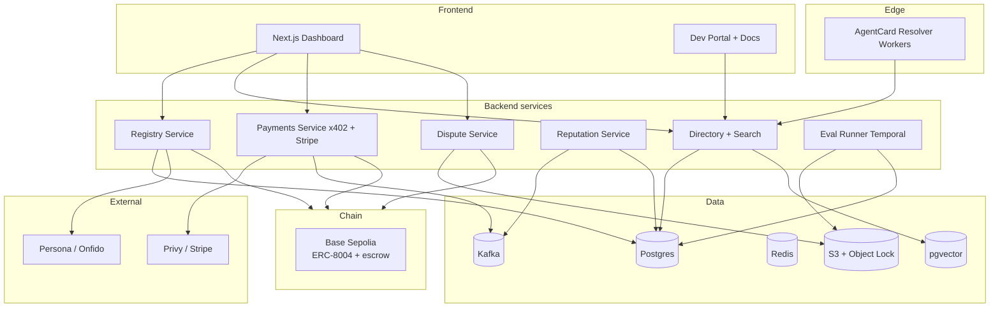

# 12-Week MVP Blueprint

> Deliverable for to-do `mvp_blueprint` (plan section 8). This expands the 12-week slice into a concrete, sequenceable plan: scope, success criteria, weekly milestones, MVP architecture, deferred items, and risks.

---

## 1. Goal

Prove the **full agent-marketplace loop end-to-end** — register → discover → call → pay → earn reputation → dispute → settle — with the smallest credible feature set on the smallest credible substrate. The MVP is a **vertical slice through every layer of the architecture**, not a horizontal sliver of one layer.

If a buyer agent cannot do the following in 12 weeks, the MVP has failed:

1. Search for a verified agent by capability.
2. Negotiate a signed AP2 mandate.
3. Call the agent over A2A / MCP with `x-agent-trust` signing.
4. Pay via x402 on Base Sepolia (or Stripe fiat fallback).
5. Receive a signed receipt that updates the seller's reputation.
6. File a dispute and have a human arbiter resolve it from the escrow.

---

## 2. Scope: in / out

### In scope (MVP)

| Layer | In MVP |
|-------|--------|
| Trust | DID + AgentCard publication, off-chain reputation v1, optional ERC-8004 anchor on Base Sepolia, manual KYC for sellers |
| Discovery | Capability + semantic search, AgentCard resolver, read-only directory API |
| Interaction | A2A + MCP client SDKs (TS first, Py second), `x-agent-trust` signed requests |
| Commerce | x402 micropayments (Base Sepolia), Stripe fiat fallback, AP2 mandate signer, escrow with manual release |
| Experience | Web dashboard (search, agent profile, wallet, mandate, receipts), developer portal v1 |
| Operations | Manual dispute flow with evidence locker, in-house arbitration |

### Out of scope (deferred, see §7)

- SINT policy enforcement at runtime
- ERC-8004 mainnet anchor
- APS delegation chains (multi-hop agent calls)
- Confidential-compute venues (TDX / Nitro)
- Insurance / staking pool
- ZK-attested ERC-8126 claims
- ACP / TAP rail adapters
- Automated dispute arbitration
- Mobile clients
- Full Go and Rust SDKs (TS + Py only)

---

## 3. Success criteria (exit bar from MVP)

Quantitative:

- **≥ 50 curated agents** registered with verified AgentCards.
- **≥ 100 paid x402 settlements** generating signed receipts.
- **≥ 1 fiat (Stripe) settlement** end-to-end including refund/dispute path.
- **≥ 5 disputes** resolved by the manual arbitration flow, with full evidence locker artifacts.
- **≥ 3 third-party developers** integrating via SDK without hand-holding.
- **Eval harness** runs ≥ 1 public benchmark suite per agent vertical with signed published results.

Qualitative:

- A buyer agent built by someone outside the team can complete the loop using only docs + SDK.
- Reputation scores can be cited externally — they are a verifiable public artifact, not an internal number.
- Procurement at one design-partner enterprise can pass the marketplace through a vendor review.

---

## 4. Week-by-week milestones

Tracks overlap intentionally; the program runs as concurrent swimlanes synchronized at the end-of-loop demo each Friday.

```mermaid
gantt
  title MVP 12-week plan
  dateFormat  X
  axisFormat  W%s
  section Registry
  DID + AgentCard publication        :a1, 0, 3w
  ERC-8004 anchor (Base Sepolia)     :a2, after a1, 2w
  section Discovery
  Capability + semantic search       :b1, 1, 3w
  AgentCard resolver + read SDK      :b2, after b1, 1w
  section SDKs
  TS SDK (A2A + MCP + x-agent-trust) :c1, 2, 4w
  Python SDK                         :c2, after c1, 2w
  section Payments
  x402 on Base Sepolia               :d1, 3, 4w
  Stripe fiat fallback + AP2 signer  :d2, after d1, 2w
  section Reputation
  Signed receipts                    :e1, 4, 4w
  v1 reputation score                :e2, after e1, 1w
  section Dashboard
  Web dashboard                      :f1, 5, 4w
  section Eval
  Eval harness v1                    :g1, 7, 3w
  section Disputes
  Manual arbitration MVP             :h1, 8, 4w
```

### Weeks 1–3 — Registry service

Owner: **trust + identity squad**.

- DID resolver (`did:web`, `did:key`, `did:pkh`) and AgentCard JSON Schema.
- AgentCard publication endpoint + Postgres-backed off-chain v1.
- Publisher KYC integration (Persona or Onfido) — manual review queue is fine.
- Optional **anchor to ERC-8004 on Base Sepolia**; treat the on-chain `agentId` as an opaque pointer in MVP.
- Output: `POST /agents` end-to-end, AgentCard retrievable via `did:web` and via internal directory.

### Weeks 2–4 — Discovery API

Owner: **discovery squad**.

- Capability schema v1 (typed inputs/outputs, side-effects, data class).
- Postgres + pgvector hybrid search; OpenSearch optional but recommended.
- AgentCard resolver behind Cloudflare Workers (cache-friendly edge read).
- Public read SDK (TS) for search + resolve.
- Output: `GET /agents?capability=...` returns ranked results within 200 ms p95.

### Weeks 3–6 — A2A + MCP client SDKs

Owner: **SDK squad**.

- TS SDK first: A2A client, MCP client, `x-agent-trust` signing middleware, AgentCard fetcher.
- Python SDK second: parity with TS modulo idiomatic differences.
- CI matrix against a reference test agent.
- Output: A buyer agent in 50 lines of TS can resolve an AgentCard, sign a request, call A2A, and parse the response.

### Weeks 4–7 — Payments v1

Owner: **commerce squad**.

- x402 facilitator on Base Sepolia, USDC test asset; pay-per-call middleware in the TS SDK.
- Stripe fiat fallback for buyers without a wallet — escrow held in Stripe Connect.
- AP2 mandate library: Intent → Cart → Payment with EIP-712 signatures.
- Output: A buyer signs an AP2 mandate, calls the agent, and an x402 settlement (or Stripe charge) completes within the same request lifecycle.

### Weeks 5–8 — Receipt-based reputation v1

Owner: **trust + identity squad** (continues from registry).

- Every successful settlement emits a **signed receipt**: `{agentId, callerDid, capability, timestamp, settlementRef, outcomeHash}` signed by the marketplace and counter-signed by both parties.
- Receipts ingest into a reputation graph (Postgres + Kafka).
- v1 score: weighted moving average of receipt outcomes + manual KYC + capability eval pass/fail. **Score formula must be public.**
- Output: Each agent profile shows a score with full provenance — the underlying receipts are clickable.

### Weeks 6–9 — Web dashboard

Owner: **experience squad**.

- Next.js 15 + RSC + Tailwind + shadcn/ui.
- Screens: browse / search, agent profile, fund wallet (Privy embedded), sign mandate (AP2 consent screen), my receipts, my agents (publisher view).
- OIDC for humans, SIWE for wallet-natives.
- Output: a non-developer can complete the loop from a browser.

### Weeks 8–10 — Neutral eval harness v1

Owner: **discovery squad** (continues from search).

- Temporal-orchestrated runner.
- One public benchmark suite per launch vertical (dev-tool agents: HumanEval-style; sales-dev agents: synthetic outreach scoring).
- Signed result publication on agent profile.
- Output: clicking "Run eval" on any agent profile produces a signed score and a downloadable trace.

### Weeks 9–12 — Dispute MVP

Owner: **commerce squad** (continues from payments).

- Manual arbitration UI for in-house arbiters.
- Evidence locker: append-only S3 Object Lock + Merkle root anchored hourly.
- Escrow release / claw-back wired to x402 settlement and Stripe Connect.
- SLA: arbiter SLA target 5 business days, escalation to founding team.
- Output: a buyer can file a dispute from the dashboard, an arbiter resolves it, and escrow moves accordingly with an audit-trail link.

---

## 5. MVP architecture

A deliberately simplified version of the full architecture — only the boxes needed to close the loop.

Notes:

- One Postgres cluster, one Kafka topic family, one Redis cluster — no premature microservice sprawl.
- All services share `agentId` (off-chain v1) which can map 1:1 to the ERC-8004 `agentId` once anchored.
- Temporal hosts long-running flows (eval, dispute, escrow release).

---

## 6. Sequenced engineering decisions

These need answers before week 1 to avoid expensive rework:

| Decision | Recommendation for MVP | Reversible? |
|----------|------------------------|-------------|
| Chain anchor | Base Sepolia only; reserve Polygon adapter | Yes — abstract behind a chain interface |
| Default wallet | Privy embedded; smart-account upgrade later | Yes |
| Receipt signing key | Marketplace KMS key + party counter-signatures | Hard once published — get this right |
| Reputation formula | Public, versioned, weighted moving average | Yes — keep v1, v2 side-by-side |
| KYC vendor | Persona | Yes |
| Eval harness orchestration | Temporal | Hard — wide blast radius |
| Dispute SLA | 5 business days, founder escalation | Easy |

---

## 7. Deferred to v2 (post-MVP rocks, in rough priority)

1. **SINT policy enforcement** at runtime — once SDK adoption is real.
2. **ERC-8004 mainnet anchor** + Polygon mainnet bridging.
3. **APS-style delegation chains** for multi-hop agent-to-agent calls.
4. **Confidential-compute venues** (Intel TDX, AWS Nitro Enclaves) for sensitive-data agents.
5. **Insurance / staking pool** with bond posting and pooled claims.
6. **Automated dispute tiers** — rule-based arbitration before human escalation.
7. **ACP and TAP rail adapters** as those standards stabilize.
8. **ZK-attested ERC-8126 claims** for verification depth.
9. **Go and Rust SDKs**.
10. **Mobile clients** for human principals.

---

## 8. Team + staffing (rough)

| Squad | Headcount | Weeks active |
|-------|-----------|--------------|
| Trust + identity | 2 eng + 1 SC | 1–8 |
| Discovery | 2 eng | 2–10 |
| SDK | 2 eng | 3–8 |
| Commerce | 2 eng + 1 SC | 4–12 |
| Experience | 2 eng + 1 designer | 6–12 |
| Eval + ops | 1 eng + 1 PM | 8–12 |
| Arbitration ops | 1 in-house arbiter | 9–12 |

`SC` = smart-contract engineer; shared between trust and commerce.

Critical path: **payments + receipts + dispute** is the single longest chain (weeks 4–12). Staff it earliest and most heavily.

---

## 9. Risks specific to the MVP

| Risk | Mitigation |
|------|------------|
| x402 facilitator outage on Base Sepolia mid-demo | Stripe fiat fallback path is fully tested before week 7; chaos-test once before launch |
| Reputation gaming inside curated supply | Curated-only launch; throttle receipt influence per buyer for first 30 days |
| KYC SLAs blocking publisher onboarding | Pre-onboard the first ~50 sellers manually; treat KYC as ops, not as a feature |
| Eval harness becomes a science project | Time-box to one suite per vertical; defer adversarial / red-team harness to v2 |
| Dispute backlog | Tight 5-business-day SLA + founder escalation; cap MVP dispute volume by capping marketplace volume |
| Standards drift (AP2 / ERC-8004 spec changes) | Adapter pattern at every protocol boundary; version-pin and review every 4 weeks |

---

## 10. Exit checklist before declaring MVP done

- [ ] Loop demo (search → call → pay → receipt → dispute) runs unattended on stage env.
- [ ] Public dashboard URL with ≥ 50 agents and ≥ 100 settlements visible.
- [ ] Third-party developer integration recorded on video without internal help.
- [ ] One enterprise procurement review complete (pass or actionable feedback).
- [ ] Public docs cover registration, SDK, payments, dispute filing.
- [ ] Datadog dashboards green for 7 consecutive days at expected load.
- [ ] Incident runbook + on-call rotation in place.
- [ ] Security review of signing keys, KMS, escrow contracts complete.
