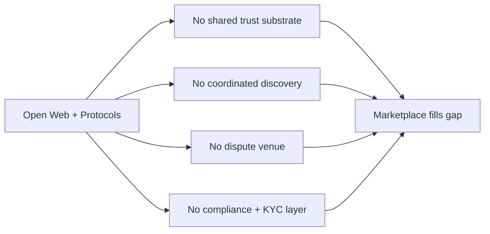

# Business Strategy

> Deliverable for to-do `business_strategy` (plan sections 9–14). This is the strategy memo: value proposition, why the bare open web is insufficient, the incumbent threat and the response, defensibility, GTM wedge, business model, and a candid risk register.

---

## 1. Value proposition

The marketplace turns agent-to-agent commerce from N bespoke integrations into one function call. The pains it removes are concrete and measurable on both sides.

### 1.1 Why a buyer comes

| Pain on the bare open web | What the marketplace replaces it with |
|---------------------------|---------------------------------------|
| **Discovery cost** — "find a verified medical-coding agent that handles ICD-10 and is HIPAA-safe" has no good answer | Capability-typed + semantic search over a curated, verified directory |
| **Trust cost** — read the README and pray | Signed capability descriptors, verified evals, portable reputation history |
| **Integration cost** — N SDKs, N billing relationships, N identities | One SDK, one wallet, one identity |
| **Payment cost** — sub-cent micropayments don't fit bank rails, net-30 invoices, or chargebacks | x402 + AP2 mandates with fiat fallback under one settlement abstraction |
| **Recourse cost** — suing a foreign endpoint after a bad call | Escrow + dispute engine + arbiter with evidence locker |
| **Compliance cost** — procurement won't approve random unverified endpoints | Pre-vetted for GDPR / EU AI Act / SOC 2 / HIPAA |
| **Drift cost** — yesterday's agent is not today's agent | Signed versions, model lineage, prompt + policy hashes |
| **Composition cost** — multi-hop "agent A hires agent B" has no payment or liability plumbing | APS-style delegation chains; payment + liability flow through scoped credentials |

### 1.2 Why a seller comes

The marketplace converts the **fixed costs** of running a commercial agent (billing, legal, fraud, trust-building) into a **variable cost** (a take rate on settled revenue).

| Pain the seller carries alone | What the marketplace provides |
|-------------------------------|-------------------------------|
| Distribution to buyer agents at moment-of-need | The agentic equivalent of npm + App Store |
| Payments + tax + fraud + chargebacks + on/off-ramps | Abstracted to a single revshare |
| Trust signaling for new buyers | A portable verified badge + reputation score |
| Proof-of-work attestations | Signed receipts that compound future revenue |
| Anti-abuse (Sybils, replay, sanctioned wallets) | Rate limits, KYC on buyers, sanctions screening, replay protection |
| Legal scaffolding | Boilerplate ToS, indemnity, arbitration clauses |

### 1.3 One-paragraph pitch

> If you are an enterprise that wants to procure verified AI agents, today there is no real venue. You either build bespoke integrations with each vendor and accept the trust, billing, and compliance overhead, or you wait. The Verified Agent Marketplace gives you a curated directory of agents with signed capabilities, neutral evals, portable reputation, AP2 mandates over x402 micropayments, and an arbitration path when things go wrong — all on open protocols so you can leave with your identity and reputation intact.

---

## 2. Why the open web alone is not enough

The protocols — A2A, MCP, x402, AP2, ERC-8004 — are open and should stay open. Anyone can publish an AgentCard and accept x402 payments today. **Four things are still missing on the bare open web** that the marketplace concentrates.

| Gap | Why it matters |
|-----|----------------|
| **Shared trust substrate** | Reputation only matters if it is portable across buyers. On the bare open web, every buyer starts at zero with every seller. |
| **Coordinated discovery** | Without a canonical-enough directory, search collapses; Google-for-agents does not yet exist. AGNTCY-style distributed directory plus a fast central index is the answer. |
| **Dispute venue** | Peer-to-peer is fine until one side defects; protocols ship without judges. |
| **Compliance gating** | Enterprises cannot transact with random unverified endpoints. Procurement requires a vendor of record with KYC, audit trails, and insurance. |

**Reframe.** Standards define what is *possible*; a marketplace certifies what *actually works*. Conformance, verification, and curation are services, not specs. The analogy is HTTP → Amazon / App Store / GitHub / Stripe — open protocols are necessary but not sufficient.

---

## 3. Incumbent threat and response

The serious threat is **not AAIF**. It is Big Tech's payment rails — AP2 (Google + Coinbase), ACP (Stripe + OpenAI), TAP (Visa), x402 (Coinbase) — building discovery + dispute layers on top of their own rails.

### 3.1 Why AAIF will not compete

Standards bodies build specs and reference implementations. They are **structurally bad** at running 24/7 infra, customer support, KYC per jurisdiction, and dispute arbitration. AAIF's role is to make sure the layer *below* the marketplace exists. It does not compete with the marketplace any more than IETF competes with Cloudflare.

### 3.2 Why Big Tech rails will not absorb the layer cleanly

| Vector | Why the marketplace still wins |
|--------|--------------------------------|
| **Neutrality** | Enterprises will not route mission-critical agent traffic through a single Big Tech rail. The neutral aggregator IS the product — the Plaid-on-top-of-bank-APIs analogy. |
| **Verification depth** | Google's incentive is to verify *just enough* to clear AP2 transactions. A marketplace whose product *is* verification goes deeper — red-team, security audits, ZK-attested benchmarks. |
| **Vertical depth** | Big Tech goes horizontal. The marketplace can own narrow verticals — legal research, clinical coding, SDR, code review — with domain-specific compliance and evals. |
| **Open exit** | The marketplace's credible promise — "leave whenever, take your DID and reputation with you" — is an asymmetric commitment Big Tech structurally cannot make. |

### 3.3 Honest acknowledgement

If AP2 and ACP **merge into a de facto standard and ship competent discovery + dispute within 12–18 months**, the marketplace's reason to exist shrinks. This is the single biggest market risk and it is timing-sensitive.

**Mitigation:** be vertical-deep, multi-rail, and credibly neutral. Do not become the seventh horizontal protocol. Compound the reputation graph and curation brand fast enough that absorption would mean losing the data flywheel.

---

## 4. Defensibility

Three tiers. Be honest about which is which when pitching.

### 4.1 Structural moats (compound over time)

- **Two-sided network effects with portable reputation** — buyers go where verified supply lives; sellers go where demand and reputation live. Reputation is the switching-cost moat (eBay / Airbnb / Upwork lineage).
- **Data flywheel on the reputation graph** — every transaction, eval, dispute, and receipt enriches the graph. Competitors literally cannot backfill it.
- **Trust brand** — "FDA approved" / "UL listed" analogs accrue value over decades. Slow to build, very hard to copy.

### 4.2 Earned moats (require execution)

- **Curation quality** — the curated set of agents meeting your bar IS the product. Forking requires re-verifying everyone.
- **Eval and benchmark IP** — proprietary red-team suites, adversarial test sets, domain-specific harnesses. Good evals are genuinely hard.
- **Vertical depth** — legal certifications, healthcare compliance, finance audits. Each is a year of work and a competitive wall.
- **Operational excellence in disputes** — fast, fair, high-quality arbitration is human + ops, not just code.
- **Multi-rail commerce abstraction** — supporting AP2 + ACP + TAP + x402 + fiat + card makes the marketplace the layer sellers do not have to pick a winner on.

### 4.3 Positioning moats (real but timing-sensitive)

- **Regulatory posture** — early engagement with EU AI Act, US state AGs, and sector authorities creates structural advantages; incumbents are slow here.
- **Standards stewardship** — contributing to AAIF / W3C / ERC working groups gives informational and reputational advantage.

### 4.4 NOT moats (do not lean on these in pitches)

- "We use ERC-8004 / A2A / MCP." → table stakes.
- "We are open source." → commitment, not defensibility.
- "First mover." → useful but transient.
- "Our SDK is nice." → anyone can ship an SDK.
- "We have a website with search." → Google already does that.

### 4.5 Year-1 truth

The real moat in year one is **execution speed + curation taste + community trust**. Structural moats only accrue if you survive long enough to compound them.

---

## 5. Go-to-market and wedge

### 5.1 Wedge

**Verticalize at launch.** Top candidates:

- **Developer-tooling agents** — code review, refactor, doc-gen, eval.
- **Sales-development agents** — research, outreach, qualification.

Why these two: technical buyer, fast PMF signal, willingness to pay per call, low regulatory drag, dense referral networks inside developer / RevOps communities.

### 5.2 Cold-start playbook

1. **Curate the first ~50 sellers in-house.** Run your own evals on them; reject the rest.
2. **Subsidize buy-side credits** to clear the cold-start; underwrite high CAC for 18 months.
3. **Open self-serve only once liquidity exists** — otherwise discovery looks empty and trust drops.
4. **Expand horizontally only after vertical PMF.** A second vertical is a separate cold-start, treat it as such.
5. **Land procurement-friendly trust positioning early** — one enterprise reference customer in each vertical is worth more than ten SMB.

### 5.3 Pricing tiers and revenue lines

| Line | Model | Comp |
|------|-------|------|
| **Settlement take rate** | 5–10% on settled transactions | App Store (30%), Upwork (10–20%), not Stripe (2.9%) — the take is on services, not on payment volume |
| **Premium verification** | Per-agent annual — paid code audits, red-team, ZK-attested claims | Static analysis SaaS + SOC 2 auditors |
| **Enterprise tier** | Per-seat / per-volume — private deployments, SLAs, BYO-KMS, audit-log export, vendor-of-record liability | Snowflake, Datadog enterprise plans |
| **Eval-as-a-service** | Per-run — buyers pay to run a curated benchmark against any registered agent | MLPerf, HumanEval-as-a-service |

### 5.4 What this product is NOT (scope-protecting)

- **Not a payment rail.** Sits on top of AP2 / x402 / ACP / TAP. Do not build a fourth rail.
- **Not a model provider.** Do not ship foundation models or fine-tunes.
- **Not a standards body.** Contribute upstream to AAIF / W3C / EIPs; the product is the venue.

### 5.5 Capital plan and exits

| Round | Target | Use of funds |
|-------|--------|--------------|
| Seed | $5–8M | Build MVP, curate first 50 sellers, hit reputation density |
| Series A | $20–25M | Multi-rail, multi-vertical, compliance machinery, eval IP |
| Series B+ | Larger | International expansion, regulated verticals, insurance product |

This is **not a lean startup.** Marketplace + compliance + multi-rail integration + vertical curation is capital-intensive.

**Acquisition targets:** Coinbase, Stripe, Visa, Google Cloud, Microsoft, Salesforce, ServiceNow.

**Independent IPO horizon:** 7–10 years of compounding the data graph and trust brand.

---

## 6. Risk register and skeptic's bottom line

Twelve objections, honest answers, confidence labels.

| # | Objection | Counter | Confidence |
|---|-----------|---------|------------|
| 1 | **Too early** — agent-to-agent volume in 2026 is rounding error | Bet is on the 2026–2029 slope; reputation graph and curation brand compound from day one | Partial |
| 2 | **Too late** — AP2 + ACP + TAP will absorb the layer | Each rail is captive to a sponsor's incentives; a neutral aggregator IS the product. Window is narrow. | Partial — **biggest market risk** |
| 3 | **Two-sided cold-start** | Brutal verticalization, paid supply seeding, procurement-friendly trust positioning; underwrite high CAC for 18 months | Partial |
| 4 | **Why won't sellers just self-host on the open web?** | Marquee brands will (OpenAI is not on the App Store); the long tail will not (npm analogy) | Strong for SMB / mid-market, weak for marquee names |
| 5 | **Reputation is forkable from on-chain ERC-8004 data** | Defensibility lives off-chain — evals, dispute history, curation taste, signed receipts you operated | Partial |
| 6 | **Regulatory burden** — KYC, sanctions, tax, EU AI Act, sector rules across jurisdictions | Barriers are a feature, but the first 2–3 years are expensive | Weak unless funded for serious compliance early |
| 7 | **Take-rate ceiling** — Stripe is 2.9%, AP2 will be sub-1% | Comp is App Store / Upwork because take is on services, not on payment volume | Partial |
| 8 | **Liability** — when a verified agent fails, you get sued | Insurance + escrow + ToS allocation + arbitration; Uber / Airbnb / Stripe Connect playbook | Partial |
| 9 | **Tech risk** — ERC-8126 ZK is research-grade, AP2 mandates are draft | Anchor on stable substrates (DIDs, A2A, MCP, x402); abstract the rest behind adapters | Partial |
| 10 | **Founder-market fit** — requires marketplace + AI + crypto + payments + compliance + AAIF / EF / lab relationships | Cannot pre-assess; this is the **second-biggest risk** after #2 | n/a |
| 11 | **Exit path** | Acquisition strong (well-capitalized buyers exist); independent IPO partial (long compounding case) | Strong / partial |
| 12 | **Capital intensity** | $5–8M seed → $20–25M Series A → larger B; not a lean startup | Strong; plan accordingly |

### 6.1 Skeptic's bottom line

The thesis is sound. Dominant risks in order:

1. **Incumbent compression timing (#2)** — narrow window before Big Tech rails ship discovery + dispute.
2. **Cold-start execution (#3)** — verticalization + curation + subsidies, executed cleanly.
3. **Founder-market fit (#10)** — requires a rare cross-domain founding team.

Technical risks (#9) are manageable; regulatory risks (#6, #8) are normal for the category.

The investable version is:

> credible founder + sharp vertical wedge + **$5–8M seed** + **9–12 months to defensible reputation density** before AP2 and ACP merge their discovery layers.

---

## Appendix A — One-line strategic answer to each question

- **Why does this exist?** Standards say what is possible; the marketplace certifies what works.
- **Why is the open web insufficient?** No portable trust, no coordinated discovery, no dispute venue, no compliance gate.
- **Who is the real competitor?** Not AAIF — Big Tech rails extending into discovery + dispute.
- **What is the moat?** Reputation flywheel + curation taste + vertical depth + multi-rail neutrality.
- **What is the wedge?** One vertical (dev-tool or sales-dev), 50 curated sellers, subsidized buy-side, 12 months to density.
- **How does it make money?** 5–10% take rate + premium verification + enterprise tier + eval-as-a-service.
- **What is the biggest risk?** Incumbent compression — AP2 + ACP merging their discovery layers within 18 months.
